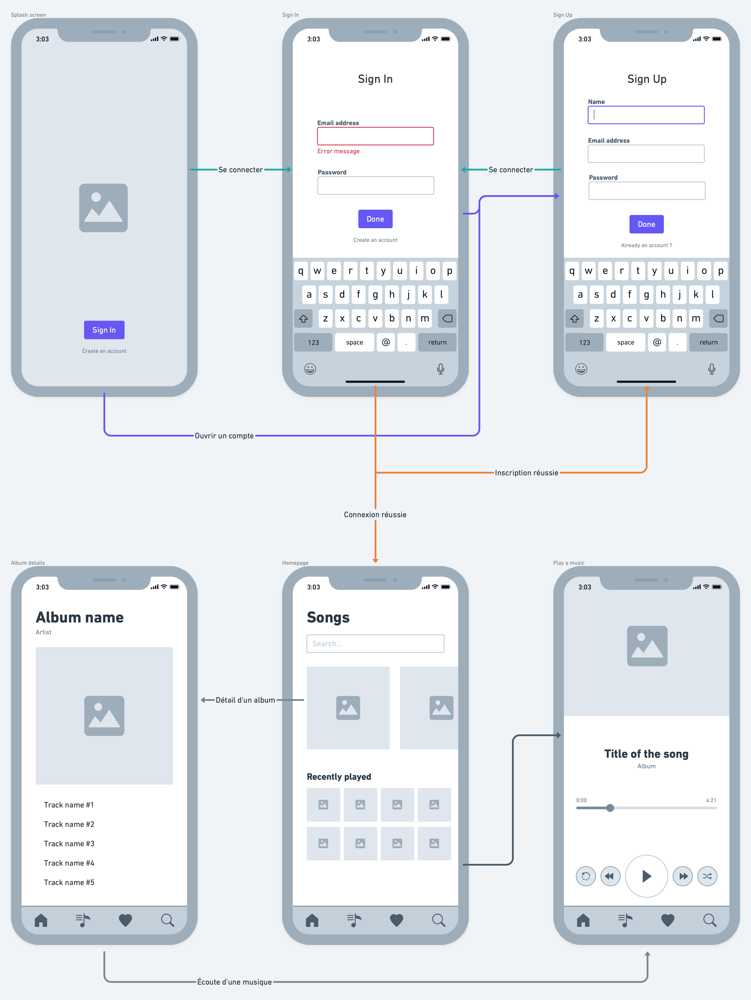

# ACS Music

## Durée du projet
**2 semaines avec présentation du projet l'après-midi du vendredi 10 septembre**

## Vue d'ensemble
Il s’agit d’une application Web mobile permettant d’écouter de la musique en ligne depuis son compte.
Dans ce projet, la lecture de la musique ne sera pas possible (audio). Il s’agit d’une maquette fonctionnelle de présentation du projet.

## Objectifs
1. Création des designs des différentes pages
2. Intégration des maquettes
3. Utilisation du JavaScript pour récupérer les différentes données et les intégrer aux pages

## Caractéristiques
L’application sera composée de 6 pages : splash screen, page de connexion, page d’inscription, page d’accueil, page de détails d’un album, page d’écoute d’une musique.

## Documentation de l'API
http://musics.logikstik.odns.fr/api/docs

## Technologies utilisées
HTML, SASS et JavaScript

## Mockups en ligne
https://whimsical.com/music-mobile-NCEPzpktL9PothapususED

## Mockups

## Liens
https://vos-competences.com -> Cours JavaScript  
https://writecode.fr/?technology=javascript -> Fiche mémo JavaScript  
https://www.sitepoint.com/get-url-parameters-with-javascript/ -> Passer des valeurs via une URL en JavaScript  
https://developer.mozilla.org/fr/docs/Web/API/Window/localStorage -> localStorage

# Notes
> :warning: **Attention ! Cet atelier n'utilise pas Node.js, donc faites attention lors de vos recherches que les articles que vous trouvez ne traite pas de ce sujet.**
